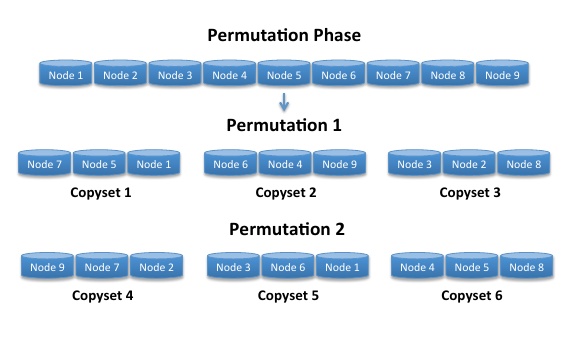
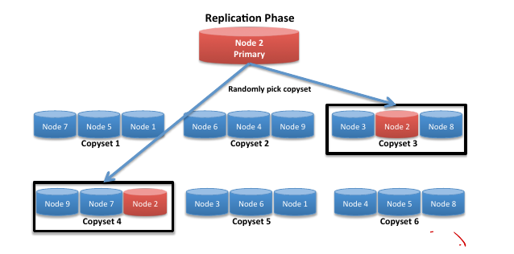

 

# Copysets: Reducing the Frequency of Data Loss in Cloud Storage


## Introduction

**Random replication** is used by data center storage systems, such as HDFS, RAMCloud, GFS and Azure. In these systems, data is partitioned into chunks, and the data in chunks is replicated. 

However, large-scale correlated failures such as cluster power outrages are handled poorly by random replication. (0.5% - 1%) of nodes do not come back to life after power restored, and the probability of data loss is high.  

A Trade-off:  **frequency of data loss events** and **the amount lost at each event**.

Sometimes, losing a single block of data incurs a high fixed cost due to the overhead of locating and recovering the unavailable data, so it's better to have fewer data loss incidents.


## Definitions

$R$: the number of replicas of each chunk

$N$: the number of nodes in the system

$S$: the scatter width, which is the number of nodes that copies for each node's data

$copysets$: the sets of $R$ nodes that stores all of the copies of a chunk

$permutation$: an ordered list of all nodes in the cluster


Low scatter width: slow recovery time from independent node failures

High scatter width: increases the frequency of data loss from correlated failures

 In the 9-node system example with $R = 3$, the following copyset construction will yield $S = 4$:

```
{1, 2, 3}, {4, 5, 6}, {7, 8, 9}, {1, 4, 7}, {2, 5, 8}, {3, 6, 9}
```


## Random Replication Design

Random Replication Algorithm:

First, or primary replica is placed on a random node from the entire cluster. 

Assuming the primary replica is placed on node i, the remaining R-1 secondary replicas are placed on random machines chosen from nodes {i + 1, i + 2, ..., i + S}. If S = N-1, the secondary replicas’ nodes are chosen uniformly from all the nodes in the cluster.

But the data loss rate is high. Multiple groups have expressed interest in reducing the incidence of data loss at th expense of losing a larger amount of data at each incident. Main reason is that there is a fixed cost to each incident of data lost in each event that is not proportional to the amount of data lost in each event. 

A trivial solution is to increase $R$. But $R$ from 3 to 4 does not provide sufficient durability, and $R = 5$ hurts the system's performance and almost double the cost of storage.


## Copysets Design

The goal of Copyset Replication is to design replication schemes that minimize the number of copysets (to minimize the probability of data loss), given any scatter width by using the smallest number of copysets. 

Ideal Algorithm: creates two permutations, and divide them into copysets.



The overall scatter width will be:
$$
S = P(R-1)
$$
However, it is not simple to implement the scheme that creates non-overlapping copysets that cover all the nodes. 

An optimal scheme: **Copyset Replication**.



**Copyset Replication** has 2 phases: **Permutation** and **Replication**.

**Permutation**: $P = \dfrac{S}{R-1}$ , can add constraints to the permutations (such as limiting nodes on the same rack)

**Replication**:  The first or primary replica can be placed on any node of the system, while the other replicas (the secondary replicas) are placed on the nodes of a randomly chosen copyset that contains the first node.


## Key insights

Copyset Replication trades off the probability of data loss with the amount of data lost in each incident.

Proposed a new way of replication that no one thinks of before.


## How Copysets advanced the Random Replication

Copyset reduces the frequency of data loss events ( 625 years  for  a 5000-node RAMCloud cluster with a loss of 64GB, compared with a loss of  344 MB on each power outage for random replication).

Copyset Replication incurs a low overhead on **HDFS** and **RAMCloud**. 

It reduces the probability of data loss in RAMCloud from 99.99% to 0.15%. In addition, Copyset Replication with 3 replicas achieves a lower data loss probability than the random replication scheme does with 5 replicas.

For Facebook’s HDFS deployment, Copyset Replication reduces the probability of data loss from 22.8% to 0.78%.


### Evaluation &  key results

Copyset Replication is equivalent to increasing the number of replicas.

Implemented on 2 open source data center: HDFS and RAMCloud

On **HDFS**, Copyset Replication is implemented entirely on the HDFS NameNode. 

When a new node joins the cluster, the NameNode randomly creates $\dfrac{S}{R-1}$ new copysets that contain it.

When a node fails, for each of its copysets we replace it with a randomly selected node. 

if the system’s goal is to prevent hot spots even in a worst case scenario with Copyset Replication,
the system designer should increase the system’s scatter width accordingly.


On **RAMCloud**, most of the code was implemented on RAMCloud’s coordinator. The Copyset Replication implementation on RAMCloud only supports a minimal scatter width (S = R-1 = 2).  

When a new backup joins the cluster, the coordinator checks whether there are three backups that are not assigned to a copyset. If there are, the coordinator assigns these three backups to a copyset.

In order to preserve S = 2, every time a backup node fails, we re-replicate its entire copyset.

Results:

- Master node Recovery overhead higher than the random replication scheme.

- Backup Recovery overhead higher.

  

## What related problems are still open?

+ How to solve the copyset minimization problem for any scatter width
