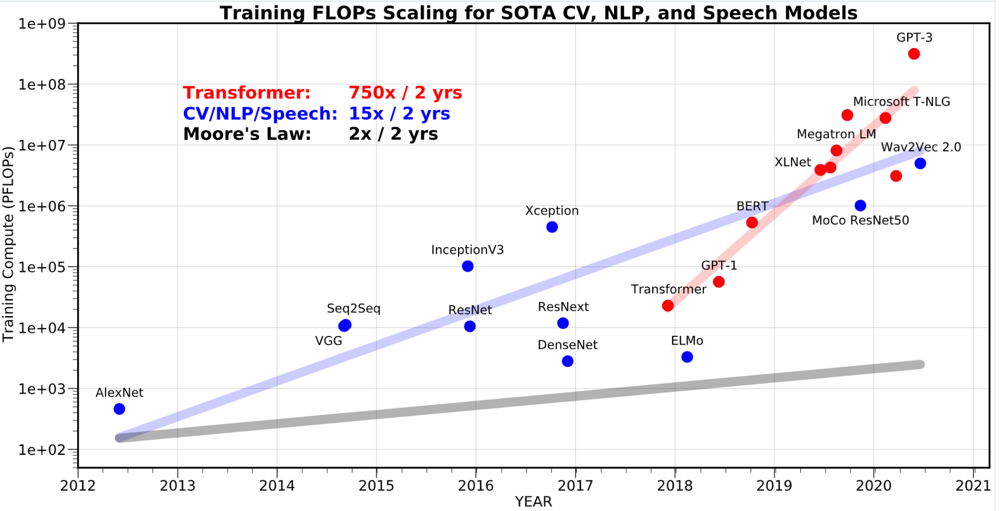
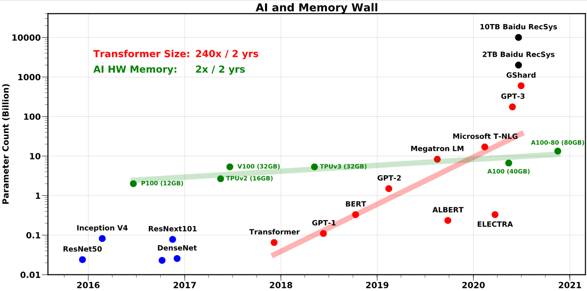
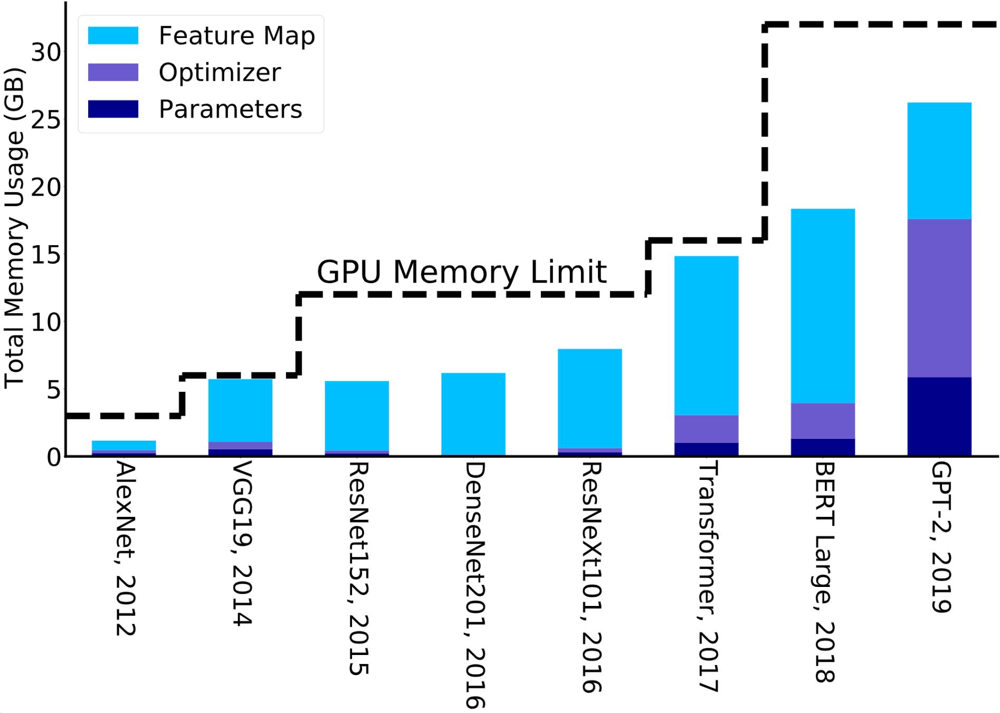
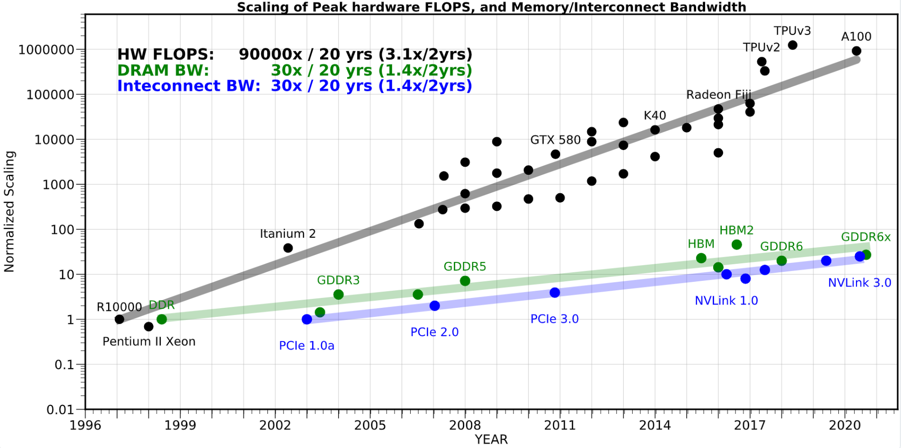

# Oneflow

## 内存墙

https://oneflow.org/a/share/jishuboke/75.html

模型规模的扩大，对硬件（算力、内存）的发展提出要求。然而，因为 [内存墙](https://oneflow.org/a/share/jishuboke/75.html) 的存在，单一设备的算力及容量，受限于物理定律，持续提高芯片的集成越来越困难，难以跟上模型扩大的需求

The amount of compute:

memory and communication bottlenecks(SOTA 模型的参数量):

训练 AI 模型时候所需要的内存一般比模型参数量还要多几倍, 这是因为训练时候需要保存中间层的输出激活值，通常需要增加3到4倍的内存占用

内存墙问题不仅和内存容量有关，还和内存的传输带宽有关。

For example, data transfer between compute logic and on-chip memory, or between compute logic and DRAM memory, or across different processors on different sockets. 上述所有情况中，容量和数据传输的速度都大大落后于硬件的计算能力。

分布式的策略一样会遇到内存墙的问题。The communication bottleneck of moving data between NN accelerators, which is even slower and less efficient than on-chip data movement. 扩展 AI 硬件之间的网络带宽的技术难题同样还未被攻破。分布式策略的横向扩展仅在通信量和数据传输量很少的情况下，才适合解决计算密集型问题。

解决方案：

- 高效的训练方法

  - 训练中使用一阶 SGD 优化方法需要暴力探索调整超参。 微软关于 Zero 论文中介绍了一个很有前景的工作：可以通过删除/切分冗余优化器状态参数，在保持内存消耗量不变的前提下，训练8倍大的模型
  - 提高优化算法的数据本地性(data locality)并减少内存占用，但是这会增加计算量。
  - 设计足够稳健的、适用于低精度训练的优化算法（半精度降低到 INT8）。

- 高效部署

  - 降低精度（如量化） 量化用于推理是可能做到超低精度级别的，但是用于训练时，想要将精度做到远低于 FP16 的级别是非常困难的。
  - 移除冗余参数（如剪枝）。在最小限度影响准确率的前提下，目前已经可以使用基于 structured sparsity 的方法剪枝掉高达 30% 的神经元，使用基于 non-structured sparsity 的方法可以剪枝掉高达 80% 的神经元。

- AI硬件设计

  - 可以有一种架构，处于CPU和GPU架构之间：它将使用更高效的缓存，更重要的是，使用更高容量的 DRAM（设计 DRAM 层次结构，不同层次拥有不同带宽）

  

## 深度学习分布式训练领域常用的技术及概念

https://zhuanlan.zhihu.com/p/276122469

### 常见的并行策略

**Data Parallelism**

**Model Parallelism**

某些情况下，模型规模特别巨大，参数特别多以至于单个GPU的显存塞不下, 于是只能通过**模型并行**的方式进行训练?  

**流水并行**

**混合并行**

https://github.com/Oneflow-Inc/oneflow-documentation/blob/master/cn/docs/parallelism/01_introduction.md

### 分布式训练和集合通信

分布式框架采用的常见底层支撑库，可以归类为以下三类：

+ **集合通信库：**用于分布式训练时，多个计算设备之间的集合通信，常见的有 Open MPI、NCCL、Gloo等

+ 数据加载与预处理库：Nvidia提供的DALI库

+ 分布式通信调度库：[Horovod](https://link.zhihu.com/?target=https%3A//github.com/horovod/horovod) 对底层通信库（MPI、NCCL、Gloo等）进行了封装，针对TensorFlow，Keras，PyTorch和Apache MXNet的分布式深度学习训练框架，提供稳定高效的通信能力。Horovod的提供的上层接口也更通用和易于用户上手，通常降低了学习门槛。

  

#### **集合通信(Collective communication)**

P2P通信通常为两个不同进程间的通信，是1对1的； 在MPI规范中，既有同步阻塞的P2P接口：**MPI_send**和**MPI_Recv**接口，也定义了非阻塞的P2P接口如：**MPI_Isend、MPI_Irecve**。

集合通信则是1对多或是多对多的。在分布式系统中，各个节点间往往存在大量的集合通信需求，而我们可以用**消息传递接口(Message Passing Interface, MPI)**来定义一些比较底层的消息通信行为

MPI常用的通信模式:

+ Broadcast

+ Scatter

+ Gather

+ Reduce

+ All reduce

+ All gather

  

#### 集合通信库

Open MPI：开源MPI（[消息传递接口](https://link.zhihu.com/?target=http%3A//www.mpi-forum.org/) ）实现

Gloo：facebook开源

NCCL： 英伟达基于NCIDIA-GPU的一套开源的集体通信库

